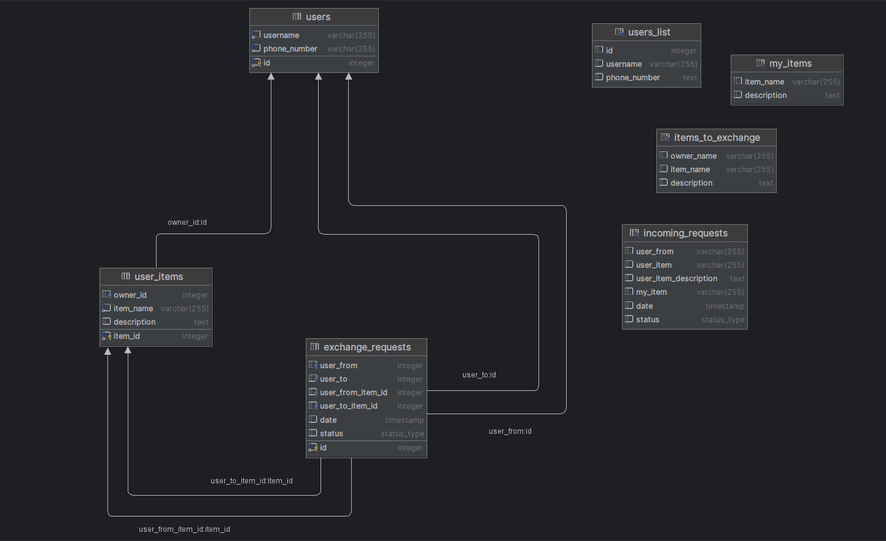

# Design Document

By Petr Chuntu

Video overview: <[URL HERE](https://youtu.be/66BzMgtPCTA )>

## Scope

The puprose of the database is to bring possibility to exchange items between users seamlessly and anonymously. 

Included in the database's scope are:

* Users, including their usernames and phone numbers
* User items, representing items owned by users, along with their descriptions
* Tracking exchange requests made by users, including details such as sender, receiver, items involved, and status
* Privacy protection: Ensuring privacy-sensitive information is safeguarded while providing necessary functionalities

Out of scope are elements like shipping logistics and advanced security measures.

## Functional Requirements

This database will support:

* Creation, tracking, and status updates of exchange requests without accessing privacy sensitive tables directly
* Views for users to see their own items, available items for exchange, and incoming exchange requests

Note that in this iteration, the system will not support DELETE operations by regular users, as much as password and username change.

## Representation

Entities are captured in PostgreSQL tables with the following schema.

### Entities

The database includes the following entities:

#### users

The `users` table includes:

* `id`: `SERIAL` - a unique identifier for the user. This column thus has the `PRIMARY KEY` constraint applied    
* `username`: `VARCHAR` - the username of the user. A `UNIQUE` constraints ensures no two users have the same username
* `phone_number`: `VARCHAR` - the user's phone number. A `UNIQUE` constraint ensures no two users have the same phone number

`username` and `phone_number` columns are required and hence have the `NOT NULL` constraint applied.

#### user_items

The `user_items` table includes:

* `owner_id`: `INT` - a unique identifier for the the owner of the item. This column has the `FOREIGN KEY` constraint applied, referencing the `id` column in the `users` table to ensure data integrity.
* `item_id`: `SERIAL` - a unique identifier for the item. This column thus has the `PRIMARY KEY` constraint applied 
* `item_name`: `VARCHAR` - the name of the item. Column is required and hence have the `NOT NULL` constraint applied
* `description`: `TEXT` - the description of the item

#### exchange_requests

The `exchange_requests` tabe includes:

* `id`: `SERIAL` - a unique identifier for the exchange. This column thus has the `PRIMARY KEY` constraint applied 
* `user_from`: `INT` - the identifier of the user initiating the request. This column has the `FOREIGN KEY` constraint applied, referencing the `id` column in the `users` table
* `user_to`: `INT` - the identifier of the user receiving the request. This column has the `FOREIGN KEY` constraint applied, referencing the `id` column in the `users` table
* `user_from_item_id`: `INT` - the identifier of the item offered by the initiating user. This column has the `FOREIGN KEY` constraint applied, referencing the `item_id` column in the `user_items` table
* `user_to_item_id`: `INT` - the identifier of the item offered by initiating user to the receiving user. This column has the `FOREIGN KEY` constraint applied, referencing the `item_id` column in the `user_items` table
* `date`: `TIMESTAMP` - the timestamp indicating when the request was made. The default value is the current timestamp, as denoted by `DEFAULT CURRENT_TIMESTAMP` constraint
* `status`: `status_type` - the custom status of the request, which can be one of the predefined values `ACCEPTED`, `PENDING`, `DECLINED`. The default value is `PENDING`, as denoted by `DEFAULT 'PENDING'` constraint

### Data types used 

Followed data types were used and additional short explanation of their advantages:

* `SERIAL` implifies the generation of unique, sequential identifiers, ensuring data integrity and facilitating database operations like joins
* `VARCHAR` saves space in the database compared to fixed-length strings (CHAR)
* `TEXT` provides flexibility by allowing to store large amounts of description text without specifying a maximum length
* `TIMESTAMP` precisely captures date and time down to fractions of a second, facilitating accurate time-based operations and comparisons

### Relationships

As detailed by the diagram:

* One user can own multiple items, creating a one-to-many relationship between the Users and User_items tables. Each item is associated with exactly one user, while each user can own multiple items
* Users interact with each other through exchange requests. Each exchange request involves two users: one initiating the request and one receiving it
* Exchange requests involve specific items offered by the sender (user_from_item_id) and requested by the receiver (user_to_item_id). Each exchange request involves two items: one offered by the sender and one requested by the receiver

## Optimizations

Per the typical queries in `queries.sql`, it is common for users of the database to access multiple views, enabling searching `username` and `item_name` columns actively. For that reason, indexes are created on the `users(username)` and `user_items(item_name)` columns to speed quering process.

`exchange()` function simplifies the process of exchange request creation, enhancing user experience.

`validate_and_exchange()` function enhances the usability of the database by ensuring the integrity of item exchanges between users. By checking item ownership before proceeding with the exchange, it prevents unauthorized or invalid transactions, thereby maintaining the accuracy and reliability of the database.

`update_accepted_status` rule allows regular users to update request status without directly accessing privacy-protected tables.

`users_list` ensures privacy by partially obscuring user's phone numbers details while still providing relevant information.

`my_items` view displays all items owned by the current user, simplifying the process of retrieving a user's items without directly accessing the underlying table.

`items_to_exchange` view lists all items available for exchange, excluding those owned by the current user. This view provides a curated list of items available for exchange, enhancing user experience.

`incoming_requests` view presents all incoming exchange requests for the current user, along with relevant details such as sender name, items involved, date, and status. It simplifies the management of incoming requests and improves user engagement in the exchange process.

## Limitations

The `my_items`, `items_to_exchange` and `incoming_requests` views may be complex to maintain and understand due to their multiple joins and filtering, which could make further development and debugging challenging.
